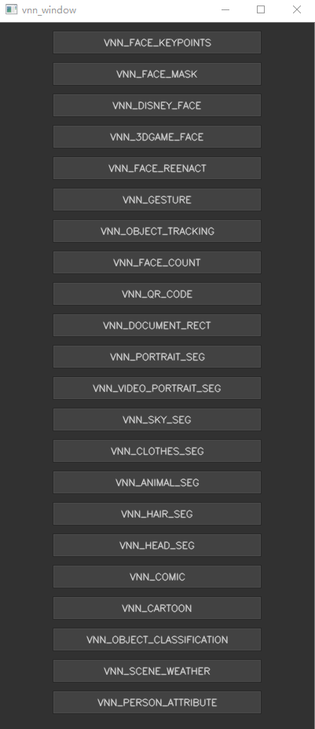
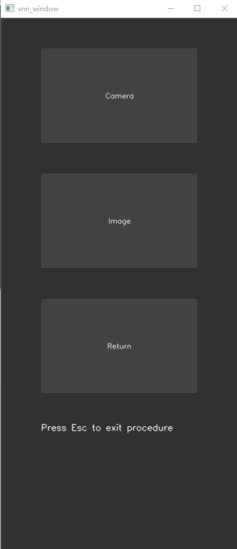

- [1. Windows端demo的第三方依赖](#1-Windows端demo的第三方依赖)
- [2. 可执行文件](#2-executable_demo)
- [3. Windows工程](#3-Windows工程)
- [4. 其它](#4-其它)
# 1. Windows端demo的第三方依赖
opencv3.4.6,  [下载地址](https://opencv.org/releases/), 约第3页，选择windows端下载，双击对应的exe，提取出opencv文件。
# 2. executable_demo
## 2.1 拷贝opencv库
```opencv\build\x64\vc15\bin```文件夹下，拷贝opencv_world346.dll，opencv_ffmpeg346_64.dll至```executable_demo```文件夹中。
## 2.2 拷贝vnn库
```libs\Windows\bin\x64```文件夹中拷贝所有的库文件至```executable_demo```文件夹中。
## 2.3 拷贝模型文件
```executable_demo```文件夹中新建文件夹，命名vnn_models, 拷贝根目录下models文件夹中的内容放入```vnn_models```文件夹中。
## 2.4 运行demo
双击vnn_win_demo.exe即可运行，如果电脑上有摄像头，启动摄像头需要约10s的时间。
## 2.4 运行界面
   
第一个界面中点击对应的功能后进入第二个界面，通过Esc推出程序,如果没有成功打开摄像头或者功能不支持相机模式，将不显示Camera按钮。
# 3. Windows工程
## 3.1 头文件
拷贝根目录下 ```libs\headers``` 文件夹中的头文件放入```vnn_win_demo\prebuilt\inc``` 文件夹中。
## 3.2 库文件
拷贝根目录下 ```libs\Windows``` 文件夹中内容放入 ```vnn_win_demo\prebuilt``` 文件夹中。
## 3.2 opencv
拷贝提取出来的opencv文件夹放入 ```vnn_win_demo\third``` 文件夹中。
## 3.4 运行build_vnn_demo_2019.bat
在```vnn_win_demo```文件夹下运行build_vnn_demo_2019.bat，会生成build_vnn_demo_2019的文件夹，文件夹中包含vs2019的工程。
## 3.5 拷贝模型文件
上一步生成的build_vnn_demo_2019文件夹中新建文件夹，命名vnn_models, 拷贝根目录下models文件夹中的内容放入```vnn_models```文件夹中。
## 3.6 打开工程并编译运行
build_vnn_demo_2019文件夹中双击vnn_demo_proj.sln打开vs2019的工程，打开工程后，解决方案资源管理器界面中设置vnn_win_demo为启动项，工程上方选择release模式，编译运行即可。

# 4. 其它
## (1) Demo仅用来展示如何调用VNN SDK.
## (2) 如果不用vs2019, 修改build_vnn_demo_2019.bat文件，设置自己需要的vs版本
## (3) 因为直接下载下来的opencv中没有x86的库，所以示例demo中生成的是64位的工程。

