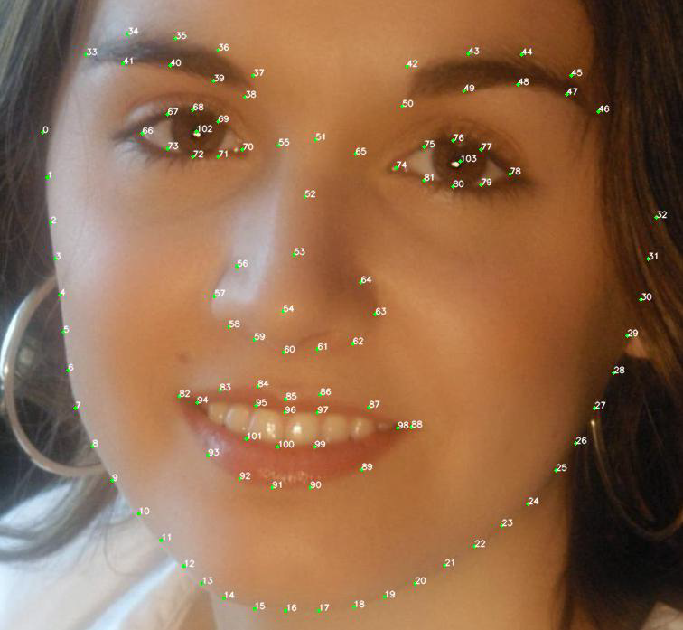
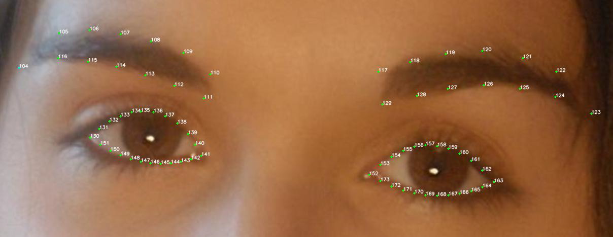
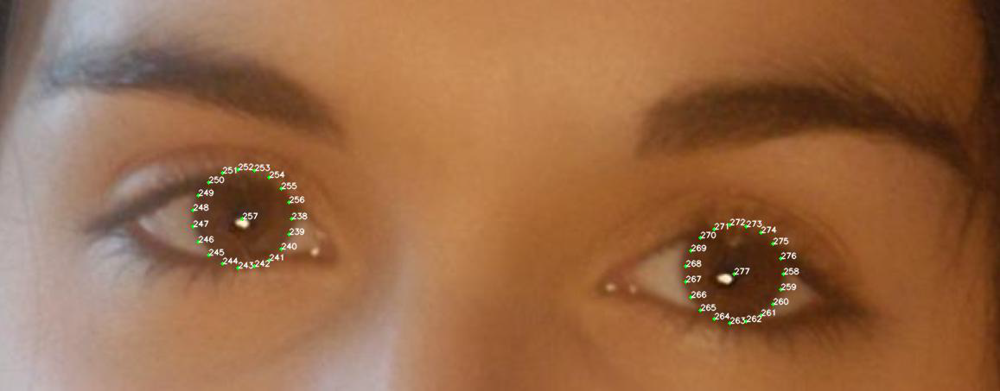

# 人脸关键点检测
- [人脸关键点检测](#人脸关键点检测)
- [一、SDK功能](#一sdk功能)
- [二、技术规格](#二技术规格)
- [三、资源依赖](#三资源依赖)
	- [3.1 头文件](#31-头文件)
	- [3.2 模型文件](#32-模型文件)
	- [3.3 动态库](#33-动态库)
- [四、相关说明](#四相关说明)
	- [4.1 104检测点](#41-104检测点)
	- [4.2 278检测点](#42-278检测点)
	- [4.3 视频流检测和图像检测的设置区别](#43-视频流检测和图像检测的设置区别)
	- [4.4 Demo示例](#44-demo示例)
- [五、API文档](#五api文档)
	- [5.1 初始化 VNN_Create_Face](#51-初始化-vnn_create_face)
	- [5.2 人脸关键点检测 VNN_Apply_Face_CPU](#52-人脸关键点检测-vnn_apply_face_cpu)
	- [5.3 资源释放 VNN_Destroy_Face](#53-资源释放-vnn_destroy_face)
	- [5.4 设置参数 VNN_Set_Face_Attr](#54-设置参数-vnn_set_face_attr)
	- [5.5 获取参数 VNN_Get_Face_Attr](#55-获取参数-vnn_get_face_attr)
- [六、更新记录](#六更新记录)

# 一、SDK功能

实时检测图像或视频中的人脸，返回每张人脸所在区域与关键点。支持多人检测   

API的输入、输出对象可参考[VNN 数据结构](./vnn_data_structure.md)   
API的执行情况（是否成功、错误原因等）可参考 ```VNN_Result``` 对应的[状态码表](./status_code.md)

---

# 二、技术规格
| 指标               | 参数                                |
| ------------------ | ----------------------------------- |
| 支持图片格式       | BGRA、RGBA、RGB、NV12、NV21、YUV420 |
| 支持架构           | armeabi-v7、arm64-v8a               |
| Android系统版本    | 5.0+                                |
| iOS系统版本        | 9.0+                                |
| 最大支持检测人脸数 | 5                                   |

---

# 三、资源依赖
## 3.1 头文件

```
vnn_face.h
vnn_kit.h
vnn_define.h
```
## 3.2 模型文件
```
face_mobile[1.0.0].vnnmodel
```
## 3.3 动态库
Android
```
libvnn_core.so
libvnn_kit.so
libvnn_face.so
```
iOS
```
Accelerate.framework
CoreVideo.framework
Foundation.framework
vnn_core_ios.framework
vnn_kit_ios.framework
vnn_face_ios.framework
```
---

# 四、相关说明

## 4.1 104检测点  
104关键点是对人脸的轮廓及五官的位置进行检测定位
点下标和位置的关系如下图   



## 4.2 278检测点
278关键点是在104关键点的基础上，增加了对眉毛、眼睛、嘴唇部位更加准确细致的检测：  
- 使用26 个关键点对眉毛进行检测定位
- 使用44 个关键点对眼睛进行检测定位
- 使用64 个关键点对嘴唇进行检测定位

共新增加134 个关键点，点下标从104接着标记，下标和位置的关系如下：   


具体的，眉毛、眼睛位置定义如下：   


嘴唇位置定义如下：   


眼球点位置定义如下：   


## 4.3 视频流检测和图像检测的设置区别   
出于保证视频流检测的实时性考虑，本SDK采用了“跳帧”的设计。为避免**单张**图像检测受影响，在设置输入图像VNN_Image时，应作如下设置
``` cpp
VNN_Image input;
input.mode_fmt = VNN_MODE_FMT_PICTURE; // 用于图像检测
input.mode_fmt = VNN_MODE_FMT_VIDEO; // 用于视频流检测
// 设置VNN_Image其他属性
```

## 4.4 Demo示例   
Android: [链接](../demos/Android/vnn_android_demo/app/src/main/java/com/duowan/vnndemo/CameraActivity.java)   
iOS: [链接](../demos/iOS/vnn_ios_demo/ios/CameraViewctrls/ViewCtrl_Camera_Face.mm)  

---
# 五、API文档
## 5.1 初始化 VNN_Create_Face
说明: 输入模型路径，完成SDK的初始化，获得用于调用后续功能的Handle
```cpp
VNN_Result VNN_Create_Face( VNNHandle * handle, const int argc, const void * argv[] )
```
| 参数   | 含义                                                                                              |
| ------ | ------------------------------------------------------------------------------------------------- |
| handle | 函数调用成功后记录合法的索引，用于调用后续功能，类型为VNN_Handle，调用成功后handle数值大于0，输出 |
| argc   | 输入模型文件数，类型为const int，输入                                                             |
| argv   | 每个模型文件的具体路径，类型为const char*[ ]，输入                                                |

返回值: VNN_Result，具体值参见 状态码表  
调用示例:  
``` cpp
VNN_Handle _handle;

std::string model = _modelpath + "/face_mobile[1.0.0].vnnmodel";

const char* argv[] = {
	model.c_str(),
};

const int argc = sizeof(argv)/sizeof(argv[0]);

VNN_Result ret = VN_Create_Face(&_handle, argc, argv);
```
## 5.2 人脸关键点检测 VNN_Apply_Face_CPU
说明: 输入包含人脸的图像，输出检测结果
```cpp
VNN_Result VNN_Apply_Face_CPU( VNNHandle handle, const void * input, void * output )
```
| 参数   | 含义                                        |
| ------ | ------------------------------------------- |
| handle | SDK实例索引，类型为VNN_Handle，输入         |
| input  | 被检测图像，类型为 VNN_Image，输入          |
| output | 检测结果，类型为 VNN_FaceFrameDataArr，输出 |

返回值: VNN_Result，具体值参见 状态码表  
调用示例:  
``` cpp
// input: 视频帧或图像，类型VNN_Image
VNN_FaceFrameDataArr faceArr;
memset(&faceArr, 0x00, sizeof(VNN_FaceFrameDataArr));
VNN_Result ret = VNN_Apply_Face_CPU(_handle_face, &input, &faceArr);
```

## 5.3 资源释放 VNN_Destroy_Face
说明: 不再使用SDK，释放内存等资源
```cpp
VNN_Result VNN_Destroy_Face( VNNHandle* handle)
```
| 参数   | 含义                                                                          |
| ------ | ----------------------------------------------------------------------------- |
| handle | SDK实例索引，成功释放资源后将被修改为0（无效值），类型为VNN_Handle，输入&输出 |

返回值: VNN_Result，具体值参见 状态码表  
调用示例:  
``` cpp
VNN_Result ret = VNN_Destory_Face(&_handle);
```

## 5.4 设置参数 VNN_Set_Face_Attr
说明: 设定SDK实例的运行参数
```cpp
VNN_Result VNN_Set_Face_Attr( VNNHandle handle, const char * name, const void * value )
```
| 参数   | 含义                                |
| ------ | ----------------------------------- |
| handle | SDK实例索引，类型为VNN_Handle，输入 |
| name   | 属性名，类型const char*，输入       |
| value  | 属性值，类型参见下表，输入          |

 **合法属性名和属性值**  

 | 属性名     | 属性含义      | 属性值                           | 属性值类型 |
 | ---------- | ------------- | -------------------------------- | ---------- |
 | _use_104pt | 使用104点检测 | 0（不使用104点）、1（使用104点） | int        |
 | _use_278pt | 使用278点检测 | 0（不使用278点）、1（使用278点） | int        |

   
返回值: VNN_Result，具体值参见 状态码表  
调用示例:  
``` cpp
// 设置使用278点检测
int _use_278pts = 1;
VNN_Result ret = VNN_Set_Face_Attr(_handle_face, "_use_278pts", &_use_278pts);
```

## 5.5 获取参数 VNN_Get_Face_Attr
说明: 获取SDK实例的运行参数
```cpp
VNN_Result VNN_Get_Face_Attr( VNNHandle handle, const char * name, const void * value )
```
| 参数   | 含义                                |
| ------ | ----------------------------------- |
| handle | SDK实例索引，类型为VNN_Handle，输入 |
| name   | 属性名，类型const char*，输入       |
| value  | 属性值，类型参见下表，输出          |

 **合法属性名和属性值**  

 | 属性名          | 属性含义                        | 属性值                                    | 属性值类型            |
 | --------------- | ------------------------------- | ----------------------------------------- | --------------------- |
 | _use_104pt      | 获取当前是否使用104点检测的信息 | 0（未使用104点）、1（使用104点）          | int*                  |
 | _use_278pt      | 获取当前是否使用278点检测的信息 | 0（未使用278点）、1（使用278点）          | int*                  |
 | _detection_data | 获取相对人脸适当扩大的检测框    | 有效的VNN_FaceFrameDataArr对象的地址/指针 | VNN_FaceFrameDataArr* |


返回值: VNN_Result，具体值参见 状态码表  
调用示例1:  
``` cpp
// 获取SDK实例当前是否使用278点检测的信息
int _use_278pts;
VNN_Result ret = VNN_Get_Face_Attr(_handle_face, "_use_278pts", &_use_278pts);
```
调用示例2:  
``` cpp
// 获取人脸关键点检测结果的同时，获取含相对人脸适当扩大的检测框的检测结果
VNN_FaceFrameDataArr faceArr, detectionArr;
memset(&faceArr, 0x00, sizeof(VNN_FaceFrameDataArr));
memset(&detectionArr, 0x00, sizeof(VNN_FaceFrameDataArr));

VNN_Result ret = VNN_Apply_Face_CPU(_handle_face, &input, &faceArr);

// 注意：在VNN_Apply_Face_CPU之后调用
VNN_Result ret = VNN_Get_Face_Attr(_handle_face, "_detection_data", &detectionArr);
```
---

# 六、更新记录
| 版本   | 日期       | 更新说明 |
| ------ | ---------- | -------- |
| v1.0.0 | 2021.12.07 | 初次发布 |
